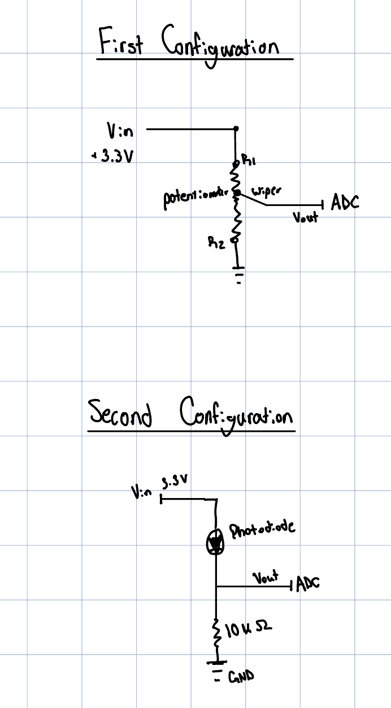
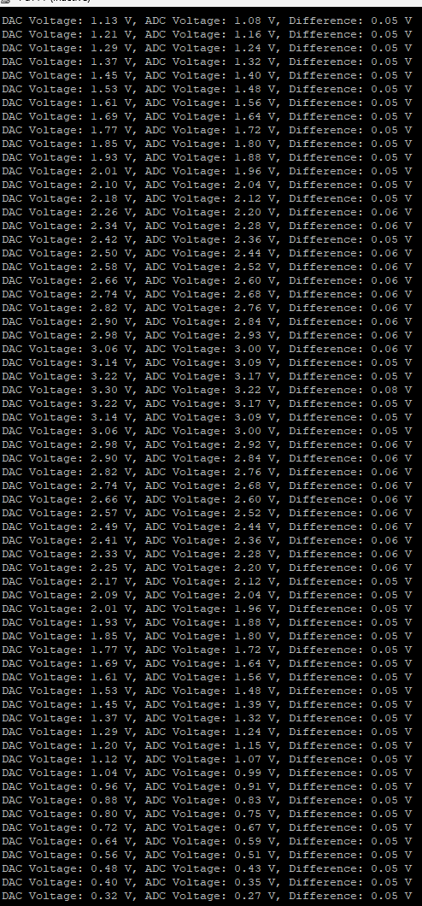

# EE186_Lab4
This is a private repository for EE186 Lab 4

## Part 2: ADC

### What are the different bit resolutions can you set the ADC? What is the maximum sampling rate at each of these resolutions? Where did you find this information in the datasheet?

The ADC uses 6, 8, 10, and 12 bit resolutions. For each, the max sampling rates are: 

12 bit- 5.33 Msps
10 bit- 6.15 Msps
8 bit- 7.27 Msps
6 bit- 8.88 Msps

This information can be found in section 6.3.21 of the datasheet in table 81 - ADC Characteristics. 

### Why do you need a voltage divider circuit? What would happen if the photodiode is directly connected to the board?

The voltage divider is needed because the photodiode produces a current proportional to light intensity and not a voltage. Because of this, we need a resistor in the voltage divider to allow us to measure the voltage and measure the voltage within the range of the ADC since it has a maximum voltage it can read. This allows us to make a proportional voltage and not have a voltage that is readable and not floating or outside of our measurable levels for voltage. 

### Circuit Diagrams

### Video Demo of photoresistor
Source Code: [photoresistor_read.c](part-2-ADC/photoresistor_read.c)

<video controls src="part-2-ADC/IMG_1424.mov" title="Title"></video>

## Part 3: DAC 

### If B = 9, what is Vout? Express your answer in terms of Vref . Use the DAC mode that provides the best resolution available on your MCU (refer to the data sheet).

If B = 9 and we are using the 12 bit DAC mode (the best resolution), then we can use n = 12 and Vout = (B/2^n)  * Vref to solve for it. 
Using this formula we get Vout = (9/2^12) Vref 
or Vout = 0.002197Vref.

### Screenshot of DAC, ADC, and differences

### How does the sampling rate of the DAC affect the quality of the output waveform? What are the differences in sound perception between sine, square, and sawtooth waves? Why do we need a capacitor in the signal path when sending an audio signal to a speaker or earphones?

1. The sampling rate determines how accurately we can reproduce the waveform. If we have a higher sampling rate we see a smoother, more accurate waveform. If we take fewer samples per cycle then we might see a distorted waveform. 

2. A sine wave is smoother and only plays one frequency. The square waves sound harsh with a weird buzzing. The sawtooth waves sound rich and very complex like it has more harmonics. 

3. We need the capacitor to act as a DC blocker. Sometimes the signals we generate to the audio might have dc components which can distort the audio and damage the circuitry over time as a result of high voltage. The capacitor blocks the dc voltages and instead passes an AC signal only that is centered arond 0 and less in magnitude. The capacitor acts as a low pass filter. 

## Part 4: Musical Instrument

